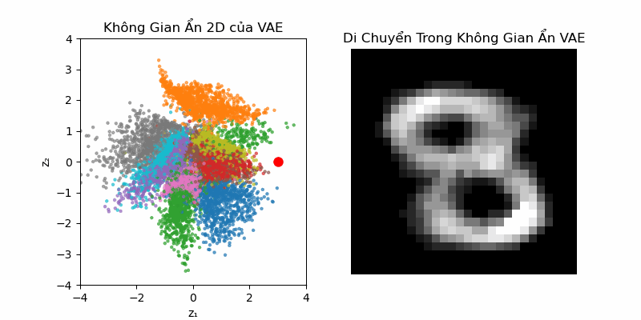
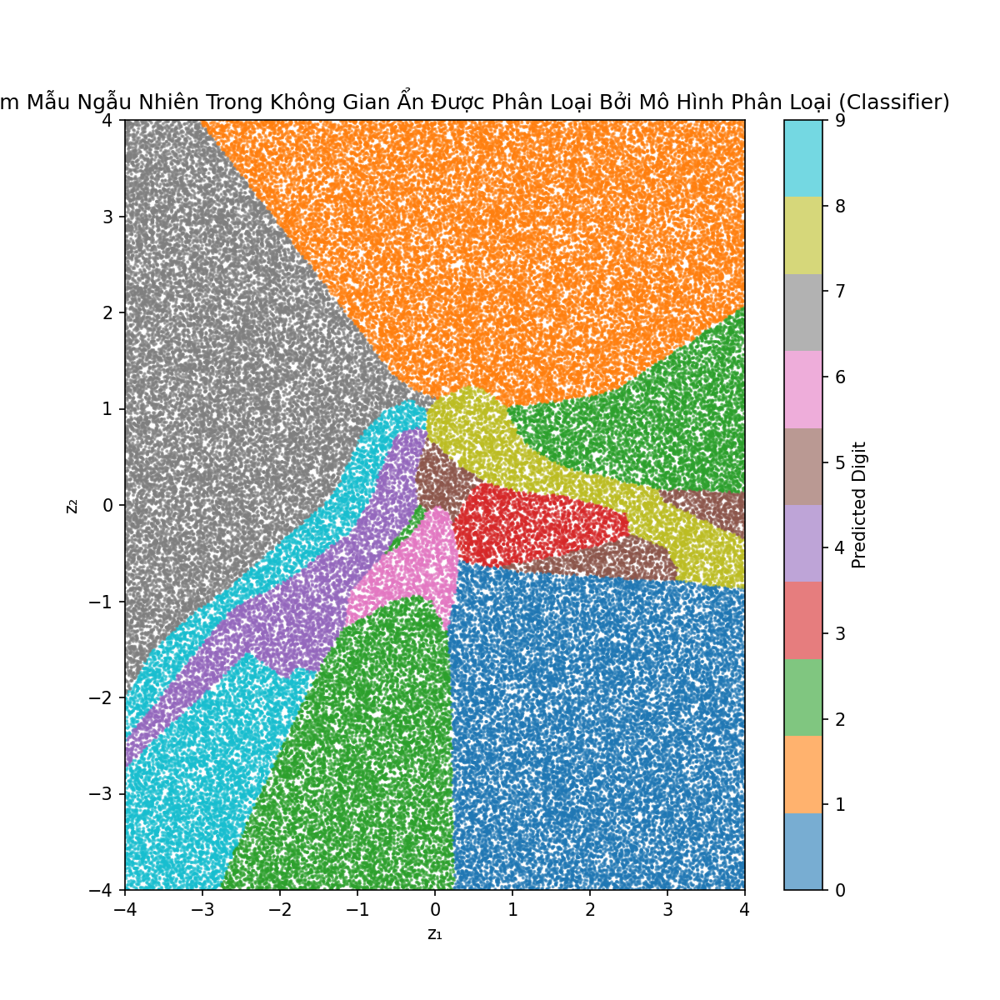
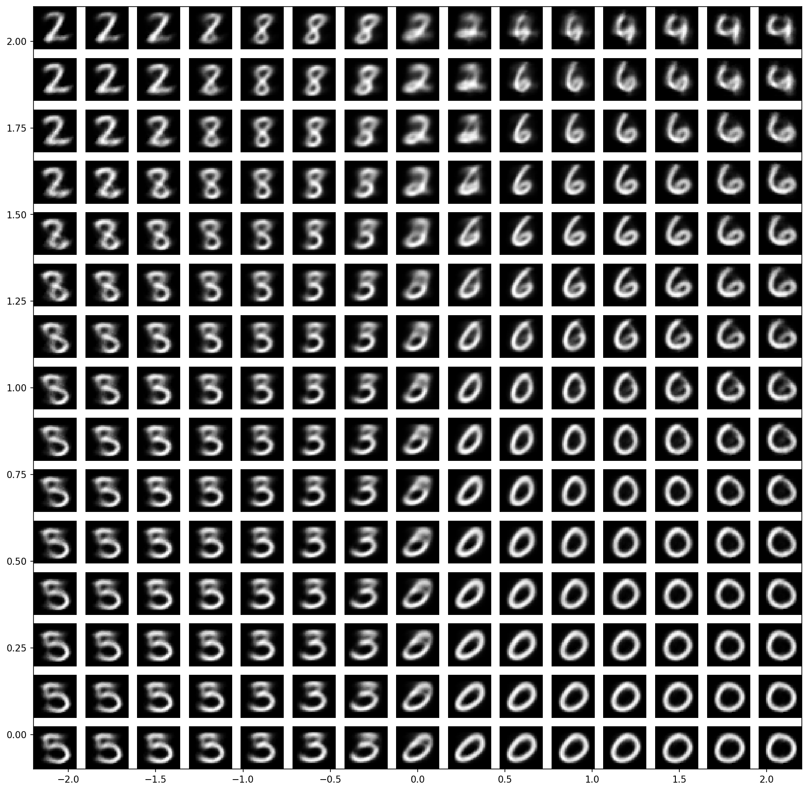
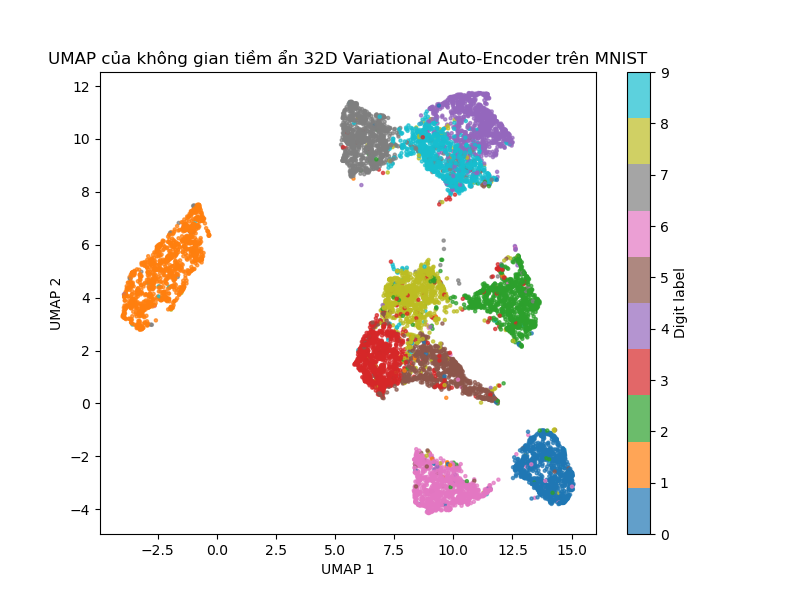
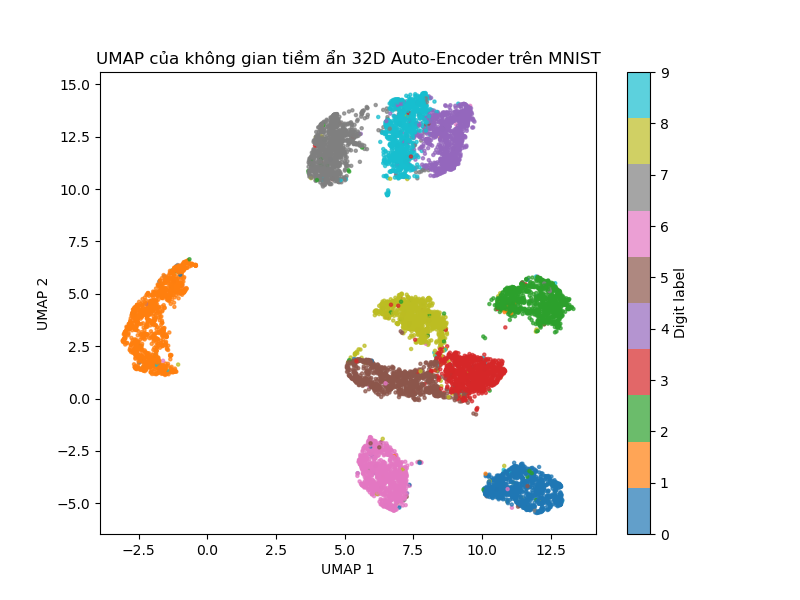

# Hướng Dẫn Về Suy Luận Biến Thiên và Mạng Nơ-ron Cho Xấp Xỉ Không Gian Ẩn

📦 Kho lưu trữ này chứa mã nguồn và kết quả nghiên cứu về các mô hình Autoencoder (AE) và Variational Autoencoder (VAE) cho bài toán xấp xỉ không gian ẩn.

## Mục Lục
- [📝 Tổng Quan Dự Án](#tổng-quan-dự-án)
- [📊 Kết Quả và Phân Tích](#kết-quả-và-phân-tích)
  - [🔍 So Sánh Mô Hình 2D](#so-sánh-mô-hình-2d)
  - [🔍 So Sánh Mô Hình 32D](#so-sánh-mô-hình-32d)
- [⚙️ Chi Tiết Triển Khai](#chi-tiết-triển-khai)
  - [📋 Yêu Cầu](#yêu-cầu)
  - [💻 Cài Đặt](#cài-đặt)
  - [✅ Kiểm Tra Cài Đặt](#kiểm-tra-cài-đặt)
  - [🗂️ Cấu Trúc Dự Án](#cấu-trúc-dự-án)
- [🚀 Hướng Dẫn Sử Dụng](#hướng-dẫn-sử-dụng)
- [📚 Bài Báo Nghiên Cứu](#bài-báo-nghiên-cứu)
- [📝 Giấy Phép](#giấy-phép)
- [📧 Liên Hệ](#liên-hệ)

## 📝 Tổng Quan Dự Án

Dự án này triển khai và so sánh bốn kiến trúc mạng nơ-ron khác nhau:

1. 🤖 **Variational Autoencoder (VAE) 2D**
   - 🎞️ Có hoạt ảnh sampling
   - 🟦 Không gian ẩn 2 chiều
   - 📈 Thể hiện bản chất xác suất của VAE

2. 🧠 **Autoencoder (AE) 2D**
   - 🟦 Không gian ẩn 2 chiều
   - 🔒 Mã hóa/giải mã xác định
   - ⚖️ Chuẩn so sánh với VAE

3. 🤖 **Variational Autoencoder (VAE) 32D**
   - 🧩 Không gian ẩn 32 chiều
   - 💪 Khả năng biểu diễn mạnh hơn
   - 🧬 Mô hình hóa dữ liệu phức tạp hơn

4. 🧠 **Autoencoder (AE) 32D**
   - 🧩 Không gian ẩn 32 chiều
   - 🔄 Dùng để so sánh trực tiếp với VAE 32D

## 📊 Kết Quả và Phân Tích

### 🔍 So Sánh Mô Hình 2D
- **Trực quan hóa không gian ẩn**
  - VAE: Không gian ẩn liên tục, cấu trúc tốt
  - AE: Thể hiện sự gom cụm và tách biệt các lớp
  - Có hoạt ảnh lấy mẫu (sampling) cho VAE

#### 🎞️ Hoạt ảnh sampling Autoencoder 2D


#### 🎞️ Hoạt ảnh sampling Autoencoder 2D (Ví dụ 2)


#### 🚶‍♂️ Hoạt ảnh di chuyển không gian ẩn VAE 2D


#### 🎲 Lấy mẫu liên tục và phân loại trong không gian ẩn bằng mô hình phân loại


#### 🗺️ Tái cấu trúc từ một phần của không gian ẩn VAE


### 🔍 So Sánh Mô Hình 32D
- **UMAP không gian tiềm ẩn 32D → 2D**
  - *VAE 32D*: Không gian tiềm ẩn 32 chiều của Variational Autoencoder được giảm chiều bằng UMAP, thể hiện sự phân tách tốt giữa các lớp số viết tay MNIST.
    
  - *AE 32D*: Không gian tiềm ẩn 32 chiều của Autoencoder cũng được giảm chiều bằng UMAP, cho thấy sự gom cụm và phân tách.
    

## ⚙️ Chi Tiết Triển Khai

### 📋 Yêu Cầu
- 🐍 Python >= 3.8 (khuyến nghị 3.8-3.10)
- 🔥 PyTorch >= 2.0.0 (có thể dùng CUDA)
- 📊 NumPy >= 1.21.0
- 📈 Matplotlib >= 3.5.0
- 🧪 scikit-learn >= 1.0.0
- 🖼️ Pillow >= 9.0.0
- 🧮 scipy >= 1.7.0

### 💻 Cài Đặt

#### Tùy chọn 1: Cài đặt cho GPU (NVIDIA GPU)
1. 🖥️ Cài đặt CUDA Toolkit (nếu muốn dùng GPU):
   - Tải và cài đặt từ [NVIDIA CUDA Downloads](https://developer.nvidia.com/cuda-downloads)
   - Đảm bảo phiên bản CUDA tương thích với GPU
2. 🔥 Cài đặt PyTorch với CUDA support:
   ```powershell
   # Windows với CUDA 11.8
   pip3 install torch torchvision torchaudio --index-url https://download.pytorch.org/whl/cu118
   # Linux với CUDA 11.8
   pip3 install torch torchvision torchaudio --index-url https://download.pytorch.org/whl/cu118
   ```

#### Tùy chọn 2: Cài đặt cho CPU
```powershell
pip3 install torch torchvision torchaudio
```

3. 📦 Cài đặt các thư viện còn lại:
```powershell
pip install numpy>=1.21.0 matplotlib>=3.5.0 scikit-learn>=1.0.0 Pillow>=9.0.0 scipy>=1.7.0
```
Hoặc sử dụng file requirements.txt:
```powershell
pip install -r requirements.txt
```

### ✅ Kiểm Tra Cài Đặt
Kiểm tra PyTorch và GPU:
```python
import torch
print(f"PyTorch version: {torch.__version__}")
print(f"CUDA available: {torch.cuda.is_available()}")
if torch.cuda.is_available():
    print(f"CUDA device: {torch.cuda.get_device_name(0)}")
```

### 🗂️ Cấu Trúc Dự Án
```
- LICENSE.md
- README.md
- requirements.txt
- Assets/
  |-- AE_assets/
  |   |-- AE_recon.png
  |   |-- AE_UMAP.png
  |   |-- sampling_1.gif
  |   |-- sampling_1.mp4
  |   |-- sampling_2.gif
  |   |-- sampling_2.mp4
  |-- VAE_assets/
  |   |-- VAE_recon.png
  |   |-- VAE_UMAP.png
  |   |-- vae_latent_walk.gif
  |-- 2D_latent_VAE_assets/
  |   |-- latent_space_classified_random_samples.png
  |   |-- latent_space_grid_sampling.png
  |   |-- latent_space.png
  |   |-- posterior_evolution.gif
  |   |-- vae_latent_walk.gif
  |   |-- posterior_frames/
  |       |-- training_posterior_0000.png
  |       |-- training_posterior_0001.png
  |       |-- ...
- Kết_quả_huấn_luyện_Autoencoder/
  |-- 2D_latent_AE/
  |-- 32D_latent_AE/
- Kết_quả_huấn_luyện_Variational_Autoecoder/
  |-- 2D_latent_VAE/
  |   |-- posterior_frames/
  |-- 32D_latent_VAE/
- MNIST/
  |-- raw/
  |   |-- t10k-images-idx3-ubyte(.gz)
  |   |-- t10k-labels-idx1-ubyte(.gz)
  |   |-- train-images-idx3-ubyte(.gz)
  |   |-- train-labels-idx1-ubyte(.gz)
- Models/
  |-- AutoEncoder_with_sampling_animation.py
  |-- AutoEncoder.py
  |-- Variational_AutoEncoder_with_sampling_animation.py
  |-- Variational_AutoEncoder.py
```

## 🚀 Hướng Dẫn Sử Dụng

1. 📦 Cài đặt các thư viện:
```powershell
pip install -r requirements.txt
```

2. ▶️ Chạy các mô hình:
```powershell
# VAE 2D có hoạt ảnh sampling
python Models/Variational_AutoEncoder_with_sampling_animation.py
# AE 2D có hoạt ảnh sampling
python Models/AutoEncoder_with_sampling_animation.py
# VAE 32D
python Models/Variational_AutoEncoder.py
# AE 32D
python Models/AutoEncoder.py
```

📁 Kết quả và hình ảnh trực quan sẽ được lưu vào các thư mục:
- Kết quả Autoencoder: `Kết_quả_huấn_luyện_Autoencoder/`
- Kết quả VAE: `Kết_quả_huấn_luyện_Variational_Autoecoder/`

## 📚 Bài Báo Nghiên Cứu
Tải xuống bài nghiên cứu tại đây!
[Download PDF](https://github.com/zombieTDV/A-Guide-to-Variational-Inference-and-Neural-Networks-for-Approximating-Latent-Spaces/blob/main/KHSV725-001.pdf)

## 📝 Giấy Phép

Dự án này được phát hành theo giấy phép MIT - xem file LICENSE để biết chi tiết.

## 📧 Liên Hệ

Nếu có câu hỏi hoặc góp ý, vui lòng mở issue trên github hoặc liên hệ với tác giả qua email: "vuongtd9261@ut.edu.vn".

---

**Lưu ý:**
- Tất cả các mô hình đều sử dụng hàm mất mát **½ SSE (half Sum of Squared Errors)** cho phần tái tạo, tức là 0.5 × tổng bình phương sai số (0.5 × sum((x - x̂)^2)).
