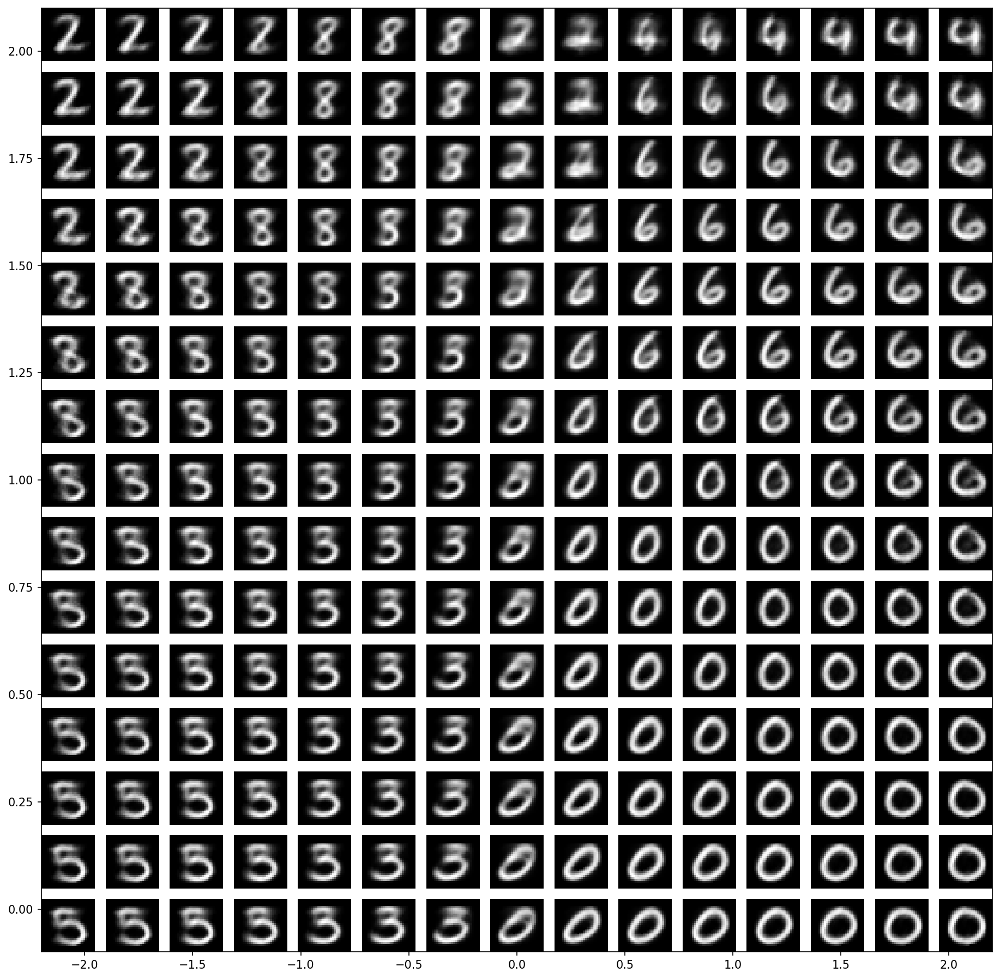

# Hướng Dẫn Suy Luận Biến Thiên và Mạng Nơ-ron Cho Xấp Xỉ Không Gian Ẩn

Kho lưu trữ này chứa mã nguồn và kết quả nghiên cứu về các mô hình Autoencoder (AE) và Variational Autoencoder (VAE) cho bài toán xấp xỉ không gian ẩn. Dự án này khám phá các kiến trúc khác nhau và khả năng học, biểu diễn không gian ẩn của chúng.

## Tổng Quan Dự Án

Dự án này triển khai và so sánh bốn kiến trúc mạng nơ-ron khác nhau:

1. **Variational Autoencoder (VAE) 2D**
   - Có hoạt ảnh sampling
   - Không gian ẩn 2 chiều
   - Thể hiện bản chất xác suất của VAE

2. **Autoencoder (AE) 2D**
   - Không gian ẩn 2 chiều
   - Mã hóa/giải mã xác định
   - Làm chuẩn so sánh với VAE

3. **Variational Autoencoder (VAE) 32D**
   - Không gian ẩn 32 chiều
   - Khả năng biểu diễn mạnh hơn
   - Mô hình hóa dữ liệu phức tạp hơn

4. **Autoencoder (AE) 32D**
   - Kiến trúc mạng nơ-ron tiêu chuẩn
   - Không gian ẩn 32 chiều
   - Chuẩn so sánh cho mã hóa chiều cao

## Kết Quả và Phân Tích

### So Sánh Mô Hình 2D
- **Trực quan hóa không gian ẩn**
  - VAE: Không gian ẩn liên tục, cấu trúc tốt
  - AE: Thể hiện sự gom cụm và tách biệt các lớp
  - Có hoạt ảnh sampling cho VAE

### Hoạt ảnh sampling Autoencoder 2D


### Hoạt ảnh sampling Autoencoder 2D (Ví dụ 2)


### Hoạt ảnh di chuyển không gian ẩn VAE 2D


#### VAE Latent Space Grid Sampling


### So Sánh Mô Hình 32D
- **Chất lượng tái tạo**
  - Chỉ số định lượng như: MSE
  - So sánh trực quan
  - Phân tích phân bố không gian ẩn

## Chi Tiết Triển Khai

### Yêu Cầu
- Python 3.8+ (khuyến nghị Python 3.8-3.10)
- PyTorch 2.0.0+ (với hoặc không có CUDA support)
- NumPy 1.21.0+
- Matplotlib 3.5.0+
- scikit-learn 1.0.0+
- Pillow 9.0.0+
- scipy 1.7.0+

### Cài Đặt

#### Tùy chọn 1: Cài đặt cho GPU (Nếu bạn có NVIDIA GPU)
1. Cài đặt CUDA Toolkit (tùy chọn, chỉ cần thiết nếu bạn muốn sử dụng GPU):
   - Tải và cài đặt CUDA Toolkit từ [NVIDIA CUDA Downloads](https://developer.nvidia.com/cuda-downloads)
   - Đảm bảo phiên bản CUDA tương thích với GPU của bạn

2. Cài đặt PyTorch với CUDA support:
```bash
# Cho Windows với CUDA 11.8
pip3 install torch torchvision torchaudio --index-url https://download.pytorch.org/whl/cu118

# Cho Linux với CUDA 11.8
pip3 install torch torchvision torchaudio --index-url https://download.pytorch.org/whl/cu118
```

#### Tùy chọn 2: Cài đặt cho CPU (Nếu bạn không có GPU hoặc không cần GPU)
```bash
# Cài đặt PyTorch cho CPU
pip3 install torch torchvision torchaudio
```

3. Cài đặt các thư viện còn lại:
```bash
pip install numpy>=1.21.0
pip install matplotlib>=3.5.0
pip install scikit-learn>=1.0.0
pip install Pillow>=9.0.0
pip install scipy>=1.7.0
```

Hoặc sử dụng file requirements.txt:
```bash
pip install -r requirements.txt
```

### Kiểm Tra Cài Đặt
Để kiểm tra PyTorch đã được cài đặt đúng với GPU support:
```python
import torch
print(f"PyTorch version: {torch.__version__}")
print(f"CUDA available: {torch.cuda.is_available()}")
if torch.cuda.is_available():
    print(f"CUDA device: {torch.cuda.get_device_name(0)}")
```

### Cấu Trúc Dự Án
```
├── Models/
│   ├── Auto_enoder_MNIST_with_sampling_animation.py
│   ├── Auto_enoder_MNIST.py
│   ├── Variational_AutoEncoder_with_sampling_animation.py
│   └── Variational_AutoEncoder.py
├── Kết_quả_huấn_luyện_Autoencoder/
│   ├── 2D_latent_AE/
│   └── 32D_latent_AE/
├── Kết_quả_huấn_luyện_Variational_Autoecoder/
│   ├── 2D_latent_VAE/
│   └── 32D_latent_VAE/
├── Assets/
│   ├── AE_assets/
│   |   ├── sampling_1.gif
│   |   ├── sampling_1.mp4
│   |   ├── sampling_2.gif
│   |   ├── sampling_2.mp4
│   |   ├── AE_UMAP.png
│   |   └── AE_recon.png
│   ├── 2D_latent_VAE_assets/
│   │   ├── posterior_frames/
│   │   ├── latent_space_grid_sampling.png
│   │   ├── latent_space.png
│   │   └── posterior_evolution.gif
│   ├── vae_latent_walk.gif
|   |__ ...
├── README.md
└── requirements.txt
```

## Hướng Dẫn Sử Dụng

1. Cài đặt các thư viện cần thiết:
```bash
pip install -r requirements.txt
```

2. Chạy các mô hình:
```bash
# Đối với VAE 2D có hoạt ảnh sampling
python Models/Variational_AutoEncoder_with_sampling_animation.py

# Đối với AE 2D có hoạt ảnh sampling
python Models/Auto_enoder_MNIST_with_sampling_animation.py

# Đối với VAE 32D
python Models/Variational_AutoEncoder.py

# Đối với AE 32D
python Models/Auto_enoder_MNIST.py
```

Kết quả và hình ảnh trực quan sẽ được lưu vào các thư mục tương ứng:
- Kết quả Autoencoder: `Kết_quả_huấn_luyện_Autoencoder/`
- Kết quả VAE: `Kết_quả_huấn_luyện_Variational_Autoecoder/`

## Bài Báo Nghiên Cứu

Mã nguồn này đi kèm với bài báo "Hướng Dẫn Suy Luận Biến Thiên và Mạng Nơ-ron Cho Xấp Xỉ Không Gian Ẩn". Bài báo trình bày chi tiết lý thuyết, phương pháp và phân tích kết quả được thể hiện trong kho lưu trữ này.

## Giấy Phép

Dự án này được phát hành theo giấy phép MIT - xem file LICENSE để biết chi tiết.

## Liên Hệ

Nếu có câu hỏi hoặc góp ý, vui lòng mở issue trên kho lưu trữ hoặc liên hệ với tác giả.
